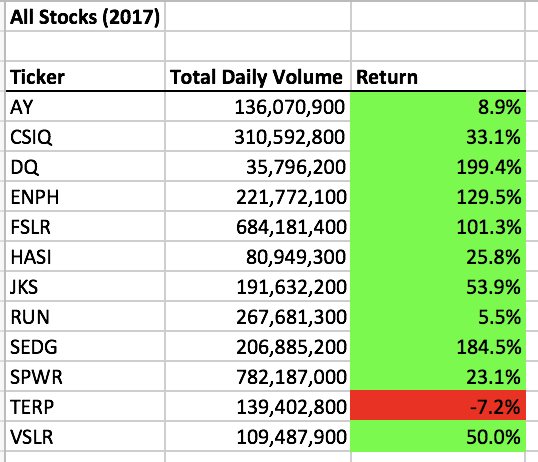

# VBA_Challenge
## Overview of Project:
This project aims to help Steve to do the stock analysis to access the entire stock market over the past few years. The analysis is informed by the results obtained by the ticker, the total daily volume and return. Therefore, a dataset of the performance of each stock was collected and analyzed using the programming language of Excel, Visual Basic for Applications (VBA).

### Results:
First of all, we need to create the ticker Index and set it equal to zero. It is as simple as: tickerIndex = 0. Next, we would need to create three output arrays. Note, array is different than creating variables. Since there are 12 tickers in total, we are putting (11) for the arrays: 
  Dim tickerVolumes(11) As Long
  Dim tickerStartingPrices(11) As Single
  Dim tickerEndingPrices(11) As Single
Then, we are using Loops to tell the computer to repeat the specific code over and over again, and we can also give how many times we would like it to repeat. We are lopping over all the ticker rows:
  For i = 2 To RowCount
  If Cells(i, 1).Value = tickers(tickerIndex) Then
  tickerVolumes(tickerIndex) = tickerVolumes(tickerIndex) + Cells(i, 8).Value
Then, we are checking if the current row is the first row with the selected tickerIndex:
  If Cells(i, 1).Value = tickers(tickerIndex) And Cells(i - 1, 1).Value <> tickers(tickerIndex) Then
  tickerStartingPrices(tickerIndex) = Cells(i, 6).Value
  End If
And, we need to check if the current row is the last row with the selected tickerIndex:
  If Cells(i, 1).Value = tickers(tickerIndex) And Cells(i + 1, 1).Value <> tickers(tickerIndex) Then
  tickerEndingPrices(tickerIndex) = Cells(i, 6).Value
  tickerIndex = tickerIndex + 1
  End If
We need to make sure that we close each code before going to the next code, and all the output should be the same as the very first one we created.

Once we run the code, we can see two colors highlighting the return. Green represents positive return, and red represents negative return. Please see Figure 1 and Figure 2 for the results of 2017 and 2018:
 
Figure 1: 

 
Figure 2: 

As we can see from the table, 2018 had a crash in the stock market. All 12 stocks we analyzed had decreased largely in return except for RUN and TERP. Although, ENPH still had positive return, ENPH did drop compare to year 2017. ENPH dropped from 129.5% to 81.9%; it is still an excellent return for this stock but 47.6% drop comparing to the previous year, ENPH is not doing as well as the previous year. On another hand, TERP’s return has increased from -7.2% to -5%. Even though it was negative and had only 2.2% change in return, it is not bad among this rough year of the stock market. Luckily, we have RUN increased 78.5% that shows this stock was performing way better among the rest. From the result we can tell that, it is not a good year to invest in the stock market in 2018.

#### Summary:
Refactoring code is to improve the quality of the code without changing the existing ones. However, it is time consuming for first time learner like me. I was unable to debug what went wrong in my code or replace the wrong code with the correct ones for the first few steps. Yet, the advantage of using VBA for refactoring is that it highlights the line of code that went wrong for you. Also, it is clear for readers to read and to understand each step. 
  I personally prefer the original VBA script than the refactored VBA script. The original one is to create variables rather than creating arrays, which is easier for me to understand. Since I wrote the code myself step by step with in depth explanation for the original script, I don’t see any disadvantages. For the refactored VBA script, it is more efficient but time consuming. I spent time figuring out what is the differences between creating variables and creating arrays. I had a hard time setting the arrays correctly because I wasn’t sure about the concept. It is easier for reader to read because I think it needs to take extra step like increasing the tickerIndex (tickerIndex = tickerIndex +1). Although I wrote the code for refactoring step by step, I still prefer the original one because I think it is less confusing for me.

